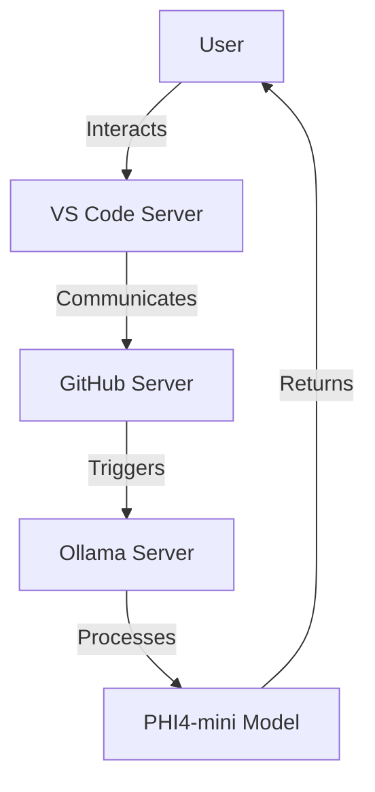

# Development Guide

This document covers the development workflow, best practices, and guidelines for contributing to the CI/CD Automation project.

## Table of Contents

- [Dev Container Setup](#dev-container-setup)
- [Local Development](#local-development)
- [Code Style and Standards](#code-style-and-standards)
- [Git Workflow](#git-workflow)
- [VS Code Extensions & Tools](#vs-code-extensions--tools)
- [TypeScript Guidelines](#typescript-guidelines)
- [Node.js Best Practices](#nodejs-best-practices)
- [MCP Integration Diagrams](#mcp-integration-diagrams)

## Dev Container Setup

This project uses [Visual Studio Code Dev Containers](https://code.visualstudio.com/docs/remote/containers) to provide a consistent development environment across all contributors.

### First-time Setup

1. Ensure you have Docker and VS Code with Remote Development extensions installed

2. Clone the repository:

   ```bash
   git clone https://github.com/your-username/cicd-automation.git
   cd cicd-automation
   ```

3. Open the project in VS Code:

   ```bash
   code .
   ```

4. When prompted, click "Reopen in Container" or use Command Palette (F1) → "Remote-Containers: Reopen in Container"

5. Wait for the container build to complete

### Container Customization

The dev container configuration is defined in `.devcontainer/devcontainer.json` and `.devcontainer/Dockerfile`.

If you need to add dependencies:

1. Modify the Dockerfile to include your required packages
2. Rebuild the container: Command Palette (F1) → "Remote-Containers: Rebuild Container"

## Local Development

### Environment Setup

1. Copy `.env.example` to `.env` and populate with your values (see [CI/CD Setup Guide](cicd-setup.md))

2. Install dependencies:

   ```bash
   npm install
   ```

### Development Workflow

1. Start the development server:

   ```bash
   npm run dev
   ```

2. Write your code in the `src` directory
3. Write tests in the `tests` directory
4. Run tests:

   ```bash
   npm test
   ```

5. Check code quality:

   ```bash
   npm run lint
   ```

## Code Style and Standards

This project follows these coding standards:

- **TypeScript/JavaScript**: [Airbnb JavaScript Style Guide](https://github.com/airbnb/javascript)
- **Formatting**: Prettier with 2 space indentation
- **Linting**: ESLint with TypeScript support

### Automatic Formatting

We use Prettier and ESLint to enforce code style. Configure your editor to format on save or run:

```bash
# Format code
npm run format

# Check code style without fixing
npm run format:check

# Run linter with auto-fix
npm run lint:fix
```

## Git Workflow

We follow a standard Git workflow:

1. Create a feature branch from `develop`:

   ```bash
   git checkout develop
   git pull
   git checkout -b feature/your-feature-name
   ```

2. Make your changes, commit with meaningful messages:

   ```bash
   git add .
   git commit -m "feat: add new feature"
   ```

   We follow [Conventional Commits](https://www.conventionalcommits.org/) format:
   - `feat:` for new features
   - `fix:` for bug fixes
   - `docs:` for documentation
   - `chore:` for maintenance tasks
   - `refactor:` for code changes that neither fix bugs nor add features

3. Push your branch and create a pull request:

   ```bash
   git push -u origin feature/your-feature-name
   ```

4. After review and approval, your PR will be merged into `develop`

## VS Code Extensions & Tools

Recommended extensions are configured in `.vscode/extensions.json`. When opening the project in VS Code, you'll be prompted to install them.

Key extensions include:

- ESLint
- Prettier
- GitLens
- Docker
- Remote Development Pack

## TypeScript Guidelines

- Use TypeScript for all new code
- Define interfaces for all data structures
- Avoid `any` type when possible
- Use strict null checks
- Leverage type inference when appropriate

## Node.js Best Practices

- Use async/await instead of callbacks
- Handle errors properly using try/catch
- Use environment variables for configuration
- Validate user inputs
- Follow the principle of least privilege

## MCP Integration Diagrams

### Container Architecture

Below is a visual representation of the MCP container architecture:



This diagram illustrates the flow of interactions between the user, VS Code server, GitHub server, and the Ollama server hosting the PHI4-mini model.

---

Last Updated: April 10, 2025
